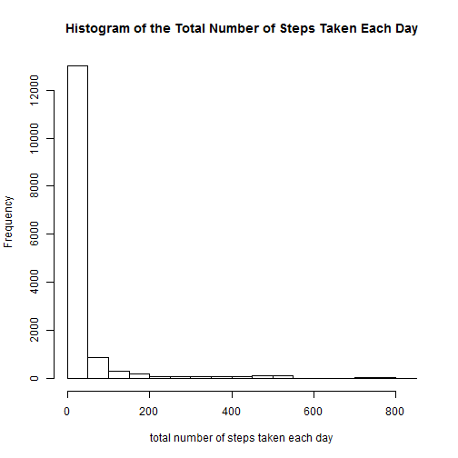
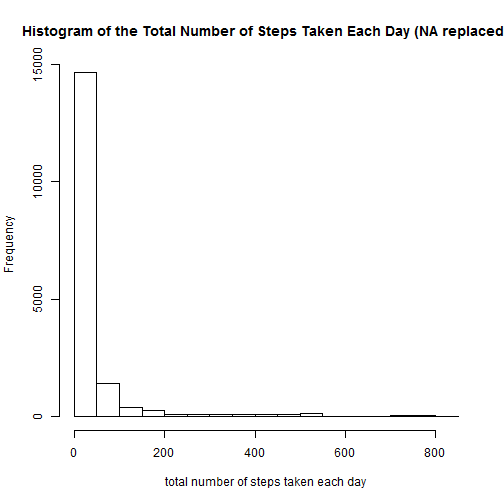

# Reproducible Research: Peer Assessment 1

First make sure that the language shown is English

```r
Sys.setlocale("LC_TIME", "English")
```

```
## [1] "English_United States.1252"
```

## Loading and preprocessing the data

```r
unzip("activity.zip")
data<-read.csv("activity.csv",header=TRUE,na.strings="NA",colClasses=c("integer","Date","factor"))
```

## What is mean total number of steps taken per day?

ignore the missing values in the dataset

```r
datan<-na.omit(data)
rownames(datan)<-1:nrow(datan)
head(datan)
```

```
##   steps       date interval
## 1     0 2012-10-02        0
## 2     0 2012-10-02        5
## 3     0 2012-10-02       10
## 4     0 2012-10-02       15
## 5     0 2012-10-02       20
## 6     0 2012-10-02       25
```

1.Make a histogram of the total number of steps taken each day

```r
library(ggplot2)
ggplot(datan,aes(date,steps))+geom_bar(stat="identity",fill="darkgreen",color="darkgreen",width=.5)+labs(title="Histogram of the Total Number of Steps Taken Each Day",x="Date",y="Total number of steps")
```

 

2.Calculate and report the mean and median total number of steps taken per day

compute the total number of steps taken each day

```r
totalSteps<-aggregate(datan$steps,list(Date=datan$date),FUN="sum")$x
```
*mean*

```r
meanSteps<-mean(totalSteps)
meanSteps
```

```
## [1] 10766
```
*median*

```r
medianSteps<-median(totalSteps)
medianSteps
```

```
## [1] 10765
```

## What is the average daily activity pattern?

1.Make a time series plot (i.e. type = "l") of the 5-minute interval (x-axis) and the average number of steps taken, averaged across all days (y-axis)

```r
averageSteps<-aggregate(datan$steps,list(interval=as.numeric(as.character(datan$interval))),FUN="mean")
colnames(averageSteps)[2]<-"stepsMean"
ggplot(averageSteps,aes(interval,stepsMean))+geom_line(color="red",size=1)+labs(title="Time Series Plot of the 5-minute Interval",x="5-minute intervals",y="Average number of steps taken")
```

 

2.Which 5-minute interval, on average across all the days in the dataset, contains the maximum number of steps?

```r
averageSteps[averageSteps$stepsMean==max(averageSteps$stepsMean),]$interval
```

```
## [1] 835
```

## Imputing missing values

1.Calculate and report the total number of missing values in the dataset (i.e. the total number of rows with NAs)

```r
sum(is.na(data))
```

```
## [1] 2304
```

2.Devise a strategy for filling in all of the missing values in the dataset. The strategy does not need to be sophisticated. For example, you could use the mean/median for that day, or the mean for that 5-minute interval, etc.

In this assignment, the mean for that 5-minute interval is used to fill in the missing values in the dataset.

3.Create a new dataset that is equal to the original dataset but with the missing data filled in.

```r
dataNew<-data
for (i in 1:nrow(dataNew)){
  if (is.na(dataNew$steps[i])){
    dataNew$steps[i]<-averageSteps[which(averageSteps$interval==dataNew$interval[i]),]$stepsMean
  }
}
head(dataNew)
```

```
##     steps       date interval
## 1 1.71698 2012-10-01        0
## 2 0.33962 2012-10-01        5
## 3 0.13208 2012-10-01       10
## 4 0.15094 2012-10-01       15
## 5 0.07547 2012-10-01       20
## 6 2.09434 2012-10-01       25
```

```r
sum(is.na(dataNew))
```

```
## [1] 0
```

4.Make a histogram of the total number of steps taken each day and Calculate and report the mean and median total number of steps taken per day. Do these values differ from the estimates from the first part of the assignment? What is the impact of imputing missing data on the estimates of the total daily number of steps?

```r
ggplot(dataNew,aes(date,steps))+geom_bar(stat="identity",fill="darkgreen",color="darkgreen",width=.5)+labs(title="Histogram of the Total Number of Steps Taken Each Day (without missing data)",x="Date",y="Total number of steps")
```

 

```r
totalStepsNew<-aggregate(dataNew$steps,list(Date=dataNew$date),FUN="sum")$x
meanNew<-mean(totalStepsNew)
meanNew
```

```
## [1] 10766
```

```r
medianNew<-median(totalStepsNew)
medianNew
```

```
## [1] 10766
```

```r
meanNew-meanSteps
```

```
## [1] 0
```

```r
medianNew-medianSteps
```

```
## [1] 1.189
```
Conclusion: after imputing missing data,the mean of the total number of steps taken per day remains the same, however, the median of the total number of steps taken per day is larger than the old one.

## Are there differences in activity patterns between weekdays and weekends?

1.Create a new factor variable in the dataset with two levels – “weekday” and “weekend” indicating whether a given date is a weekday or weekend day.

```r
dataNew$weekdays<-as.factor(weekdays(dataNew$date,abbreviate = FALSE))
levels(dataNew$weekdays)<-list(weekday=c("Monday","Tuesday","Wednesday","Thursday","Friday"),weekend=c("Saturday","Sunday"))
levels(dataNew$weekdays)
```

```
## [1] "weekday" "weekend"
```

```r
head(dataNew)
```

```
##     steps       date interval weekdays
## 1 1.71698 2012-10-01        0  weekday
## 2 0.33962 2012-10-01        5  weekday
## 3 0.13208 2012-10-01       10  weekday
## 4 0.15094 2012-10-01       15  weekday
## 5 0.07547 2012-10-01       20  weekday
## 6 2.09434 2012-10-01       25  weekday
```

2.Make a panel plot containing a time series plot (i.e. type = "l") of the 5-minute interval (x-axis) and the average number of steps taken, averaged across all weekday days or weekend days (y-axis). 

```r
averageSteps<-aggregate(dataNew$steps,list(interval=as.numeric(as.character(dataNew$interval)),weekdays=dataNew$weekdays),FUN="mean")
colnames(averageSteps)[3]<-"stepsMean"
library(lattice)
xyplot(averageSteps$stepsMean~averageSteps$interval|averageSteps$weekdays,layout=c(1,2),type="l",xlab="Interval",ylab="Number of steps")
```

 
